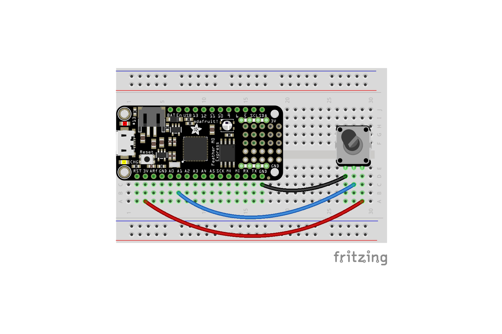
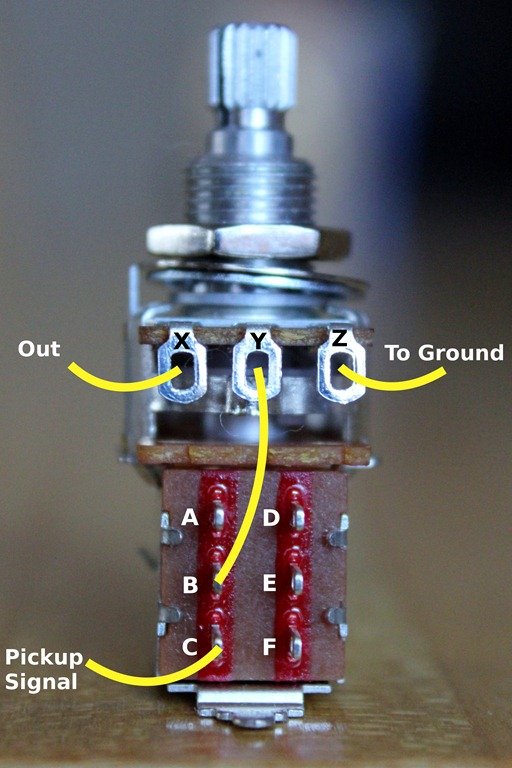

# Lightsaber2021
Working on some light sabers with my kids

See: https://youtu.be/GwyaHJhU9TE


I'm using a Adafruit Feather M4 Express - Featuring ATSAMD51 (ATSAMD51 Cortex M4) × 1
which I am programming in circuit python using MU editor.
(You have to turn on the enable switch to get the feather to appear as a drive)
You don't have to turn it on to charge it.

https://learn.adafruit.com/adafruit-prop-maker-featherwing

https://learn.adafruit.com/lightsaber-featherwing


The PWR Pin
As mention above, the PWR pin is low (off) by default. To turn on power to the NeoPixels, Audio output, and RGB LED output, you must set this pin high (on).

You can check the pinout for your Feather to figure out which pin to use. But here's a quick reference for some of the boards:

Feather M0/M4 = D10
Feather 32u4 = D10
Feather 328 = D10
Feather NRF52 = D11
Feather ESP8266 = D15
Feather ESP32 = D33
And be sure to checkout the examples to see how this is done in code.


RGB LED version
https://learn.adafruit.com/prop-maker-light-wand


https://circuitpython.org/board/feather_m4_express/


https://learn.adafruit.com/adafruit-feather-m0-express-designed-for-circuit-python-circuitpython/adafruit2-pinouts


Putting a potentiometer onto an feather m4 express - via the feather prop wing.

The prop wing has breakouts for the express gpio pins, but which analog in pin can I use?

https://learn.adafruit.com/adafruit-prop-maker-featherwing/pinouts

I'm going to name the sides of the boards short and long.
One side of the feather has 16 pins (long) which include analog inputs.
The other side has 12 pins (mostly digital)

The longer side is the one I am interested in.


###Logic###
Only A0 is noted as being used.
```A0 - This pin is true analog input to the audio amplifier on the FeatherWing. Matches A0 on the Feather M0's and M4's which is the DAC output. Other Feathers (like the ESP8266) don't have a DAC so you can leave this pin unused```

###Power###
First two pins 
``Reset pin - Tie to ground to reset the Feather``
``3.3V pin- 3.3V output from the Feather's regulator``


A1 is located along the edge opposite the battery connector. There are multiple ground pins. 3V is located along the same edge as A1, and is next to the reset button.

```
"""CircuitPython Essentials Analog In example"""
import time
import board
from analogio import AnalogIn

analog_in = AnalogIn(board.A1)


def get_voltage(pin):
    return (pin.value * 3.3) / 65536


while True:
    print((get_voltage(analog_in),))
    time.sleep(0.1)
```





So, today I learned that the switching tying the enable and ground pins on the prop wing, is an off-on switch, not an on-off switch.

That is - switched closed is off, switch open is on.

So, I tied an switched potentiometer onto the pins, so that I could turn the device on - and adjust an input voltage.

However, because the switch on the wing is, to my mind, backwards - the wing is only on when the switch is off - when the potentiometer is at its lowest setting.



The switch is make/break between the middle lug (eg B) and A or C for the push or pull.

I want to wire B/C as normally closed for off.

Potentiometer
pin value ranges from 160 - 65520


## 2021/09/26 Turn off sound ##

https://www.geeksforgeeks.org/time-perf_counter-function-in-python/